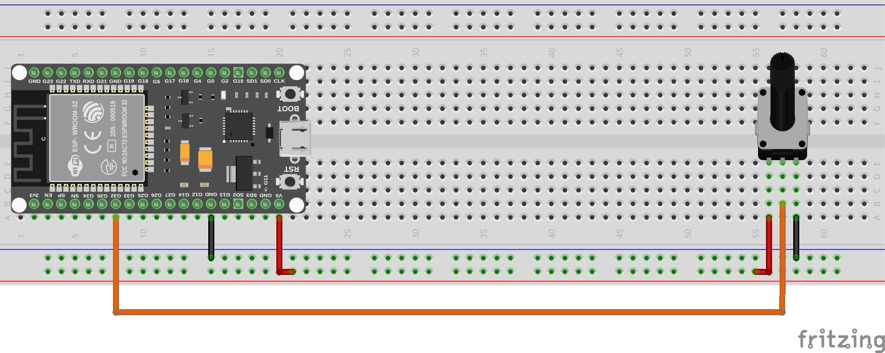
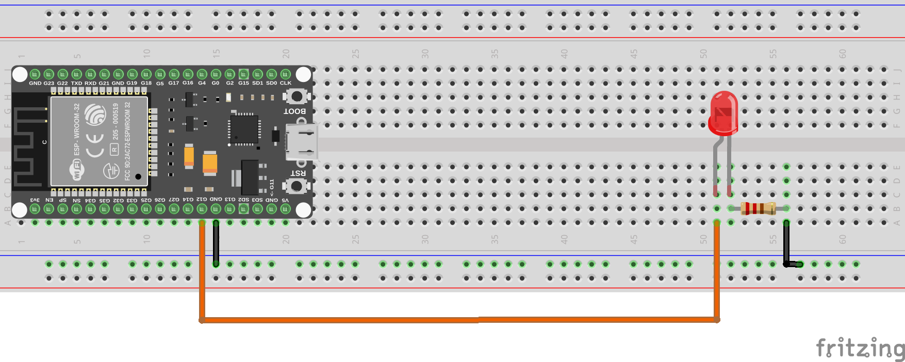

# Entrada/Salida Analógica

Nuestro dispositivo también cuenta con capacidades de entrada y salida analógica, lo que permite una interacción más precisa con sensores y actuadores que operan en un rango continuo de valores.

Las Entradas o Salidas Analógicas (E/S analógicas) permiten al dispositivo leer señales analógicas de sensores o enviar señales analógicas a actuadores. Estas E/S analógicas son esenciales para aplicaciones que requieren mediciones precisas, como la lectura de sensores de temperatura, luz, humedad, entre otros.

## Configuración de E/S Analógicas

Para configurar un pin como entrada o salida analógica, utilizamos las clases ``ADC`` (Convertidor Analógico a Digital) y ``DAC`` (Convertidor Digital a Analógico) del módulo ``machine``. Aquí hay un ejemplo de cómo configurar un pin:

```python
from machine import ADC, DAC
# Configurar un pin como entrada analógica
adc = ADC(pin_number)
# Configurar un pin como salida analógica
dac = DAC(pin_number)
```
Donde `pin_number` es el número del pin que deseas configurar.

## Lectura de Entradas Analógicas

Los valores analógicos se obtienen a partir de convertir diferentes niveles de voltaje en calores digitales gracias al uso de los DAC y ADC. Estos convierten las señales analógicas en valores digitales que el microcontrolador puede procesar.


Es importante ver el pinout de cada dispositivo ya que por ejemplo para el ESP32 los pines ADC son: 32, 33, 34, 35, 36, 39, mientras que para la Raspberry Pi Pico son: 26, 27, 28.

Para leer el valor de un pin configurado como entrada analógica, utilizaremos el método `read()` de la clase ``ADC``:

```python
from machine import ADC
adc = ADC(pin_number)
value = adc.read()
```
El valor devuelto por `read()` será un número entero que representa el nivel de voltaje en el pin, generalmente en un rango de 0 a 4095 (12 bits) o 0 a 1023 (10 bits), dependiendo del dispositivo.

Tanto Para el ESP32 como la Raspberry Pi pico, tiene un ADC de 12 bits, por lo que el valor devuelto estará en el rango de 0 a 4095.

Veamos un ejemplo.

### Ejemplo: Lectura de un Potenciómetro

Para este ejemplo, necesitarás los siguientes componentes:

- 1 Potenciómetro (10KOhmios recomendado)
- Cables de conexión
- Protoboard

El montaje que realizaremos será el siguiente:



Por último, el código para leer el valor del potenciómetro y mostrarlo en la consola es el siguiente:

```python
from machine import ADC
import time

pin_number = 32
# Configurar el pin ADC
adc = ADC(pin_number)
while True:
    # Leer el valor analógico
    value = adc.read()
    print("Valor del potenciómetro:", value)
    time.sleep(1)
```
En este ejemplo, el valor leído del potenciómetro se imprimirá en la consola cada segundo. A medida que gires el potenciómetro, el valor cambiará, reflejando el nivel de voltaje en el pin analógico.

## Escritura de Salidas Analógicas


Otro de los aspectos importantes del uso de E/S analógicas es la capacidad de generar señales analógicas para controlar actuadores como motores, servomotores, o incluso para generar señales de audio.

Este proceso se realiza utilizando el llamado PWM (Modulación por Ancho de Pulso) o mediante el uso de un DAC (Convertidor Digital a Analógico) si el dispositivo lo soporta.

En el ESP32 y Raspberry Pi Pico, podemos utilizar la clase ``DAC`` para generar señales analógicas.

Para escribir un valor en un pin configurado como salida analógica, utilizamos el método `write()` de la clase ``DAC``:

```python
from machine import DAC
pin_number = 25
dac = DAC(pin_number)
value = 128  # Valor analógico entre 0 y 255
dac.write(value)
```

El DAC que se utiliza en estos dispositivos generalmente tiene una resolución de 8 bits, por lo que el valor debe estar en el rango de 0 a 255.

Es importante conocer que los pines disponibles para realizar el llamado PWM en ESP32 son: 25, 26, 27, 14, 12, 13, 15, 2, 4, 16, 17, 18, 19, 21, 22, 23. Mientras que en la Raspberry Pi Pico son: 0, 1, 2, 3, 4, 5, 6, 7.

### Ejemplo: Generación de una Señal Analógica 

Para este ejemplo, necesitaremos los siguientes componentes:

- 1 Resistencia de 220 ohmios
- Cables de conexión
- Protoboard

El montaje que realizaremos será el siguiente:



El siguiente código genera una señal analógica variable en el pin DAC, que puede ser utilizada para controlar la intensidad de un LED o cualquier otro actuador compatible:

```python
from machine import DAC
import time
pin_number = 12  # Cambia esto al número de pin que estás utilizando

dac = DAC(pin_number)
while True:
    for value in range(0, 256, 5):  # Incrementa el valor de 0 a 255
        dac.write(value)
        time.sleep(0.05)
    for value in range(255, -1, -5):  # Decrementa el valor de 255 a 0
        dac.write(value)
        time.sleep(0.05)
``` 

Con este programa, el valor analógico se incrementa y decrementa gradualmente, lo que puede hacer que un LED conectado al pin DAC varíe su brillo de manera suave.

### Ejemplo 2: Fotocelda (LDR)

Una fotocelda o LDR (Light Dependent Resistor) es un tipo de resistor cuya resistencia varía en función de la cantidad de luz que incide sobre él. A medida que la luz aumenta, la resistencia disminuye, y viceversa.

Para este ejemplo, necesitarás los siguientes componentes:
- 1 Fotocelda (LDR)
- 1 Resistencia de 10K ohmios
- Cables de conexión
- Protoboard

El montaje que realizaremos será el siguiente:


El siguiente código lee el valor de la fotocelda y lo imprime en la consola:

```python
from machine import ADC
import time
pin_number = 33  # Cambia esto al número de pin que estás utilizando
adc = ADC(pin_number)
while True:
    value = adc.read()
    print("Valor de la fotocelda (LDR):", value)
    time.sleep(1)
```

En este ejemplo, el valor leído de la fotocelda se imprimirá en la consola cada segundo. A medida que la cantidad de luz que incide sobre la LDR cambie, el valor también cambiará, reflejando la variación en la resistencia del sensor.