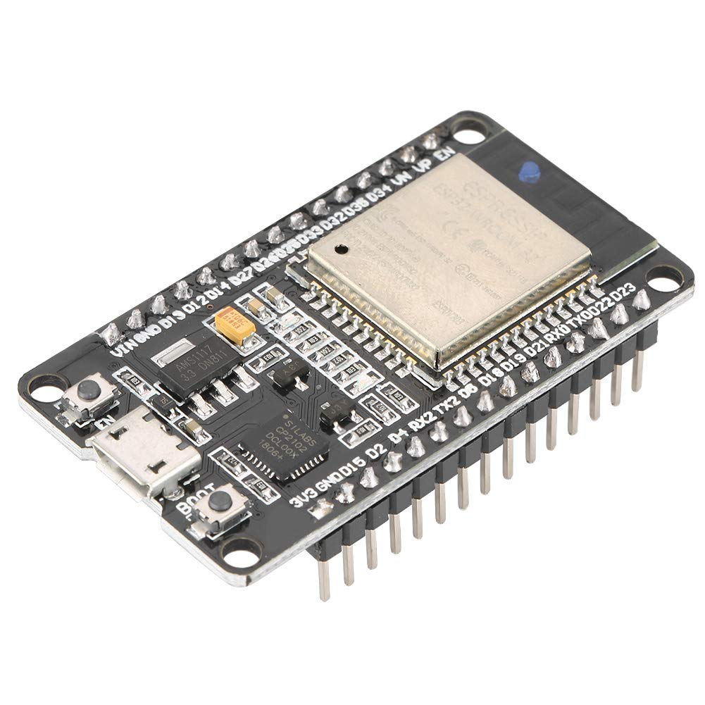
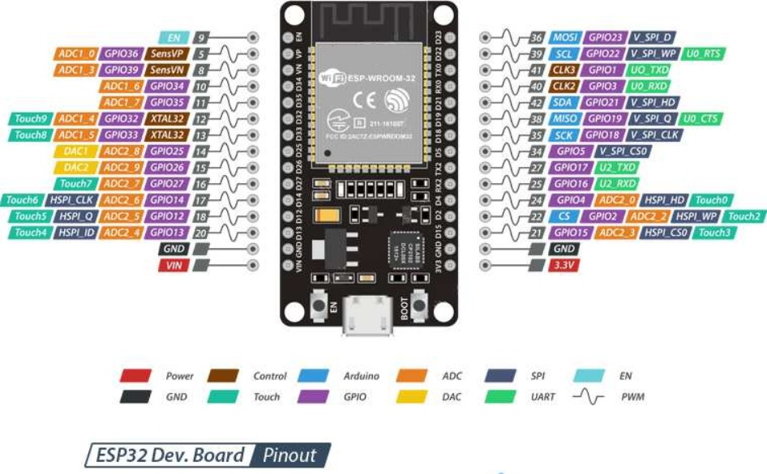

# Dispositivos

En este pequeño taller, vamos a centrarnos en dos dispositivos:

* ESP32
* Raspberry Pi Pico

Cada uno de estos microcontroladores, es compatible con MicroPython y con otros muchos lenguajes y herramientas. 

Ambos microcontroladores permiten ser programados en muchos lenguajes como puede ser C, Arduino, Node.js y por supuesto en MicroPython. Son muy sencillas de utilizar y tienen mucho soporte por la comunidad.

Vamos a ver cada una de estas placas para conocer sus características.

## ESP32

La ESP32, es un microcontrolador de espresiff, que es muy versatil y tiene mucha potencia comparado con otros microcontroladores de la misma familia.

Tiene soporte para muchos lenguajes, pero en este caso lo utilizaremos para MicroPython.

Entre sus características estan:

* CPU: microprocesador de 32 bits a doble nucleo operando a 160Mhz o 240Mhz.
* Memoria: 520KB de SRAM
* Conectividad inhalámbrica:
    * Wifi: 802.11 b/g/n
    * Bluetooth: BLE y v4.2
* Interfaces:
    * 2x 8 bit DAC
    * 4x SPI
    * 3x UART
    * 2x I2C
    * 12 Bit ADC

Puede encontrar más información sobre esta placa en:

[https://es.wikipedia.org/wiki/ESP32](https://es.wikipedia.org/wiki/ESP32)

Mostramos ademas el PInOut de la ESP-wROOm:

## Rasperry Pi Pico

Raspberry Pi Pico, es una placa programable basado en el microcontrolador RP2040; diseñado para esta placa. Permite ser programada por varios lenguajes y entre ellos micropython.

Existen varias versiones de esta placa ya que algunas incluyen wifi y otras no.

Las versiones que podemos encontrar son:

* Raspberry Pi Pico (H) 
* Raspberry Pi Pico W (WH) con conexión inhalámbrica.

Las características de esta placa son:

* Procesador Dual-core ARM Cortex M0+ hasta 133Mhz.
* 264KB de RAM y 2MB de memoria Flash
* USB 1.1 como dispositivo y como host
* 26 GPIO
* 2xSPI, 2x I2C, 2x UART 12 Bit ADC y 16 canales PWM.
* Conexión Wifi con soporte WPA3 (Sólo Raspberry Pi Pico)

Puedes encontrar más información sobre Raspberry Pi Pico en su página oficial:

[Raspberry Pi Pico](https://www.raspberrypi.com/documentation/microcontrollers/raspberry-pi-pico.html)

Dejamos además, el Piout de una raspberry Pi Pico

**Raspberry Pi Pico**

**Raspberry Pi Pico W**

