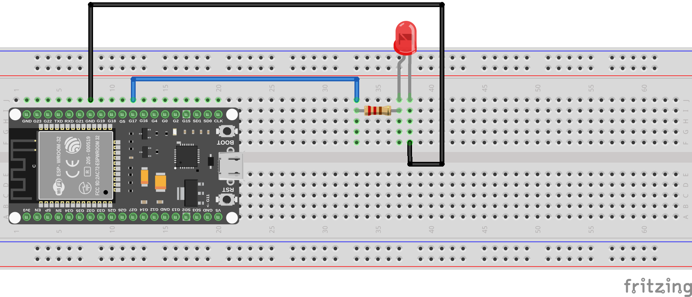
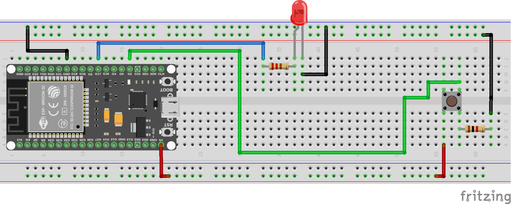

# Entrada/Salida Digital

Vamos a ver una visión general de las capacidades de entrada y salida digital de nuestro dispositivo.

Las Entradas o Salidas Digitales (E/S digitales) permiten al dispositivo interactuar con otros componentes electrónicos, como sensores, actuadores y otros dispositivos digitales. Estas E/S digitales pueden configurarse como entradas para leer señales digitales o como salidas para enviar señales digitales.

## Configuración de E/S Digitales

Para configurar un pin como entrada o salida digital, utilizamos la clase ``Pin`` del módulo ``machine``. Aquí hay un ejemplo de cómo configurar un pin:

```python
from machine import Pin

# Configurar un pin como salida digital
pin = Pin(pin_number, Pin.OUT)
# Configurar un pin como entrada digital
pin = Pin(pin_number, Pin.IN)
```

Donde `pin_number` es el número del pin que deseas configurar, y `Pin.OUT` y `Pin.IN` son constantes que indican si el pin se configura como salida o entrada, respectivamente.

## Lectura de Entradas Digitales

Para leer el estado de un pin configurado como entrada digital, utilizaremos el método ```value()``` de la clase ``Pin``:

```python
from machine import Pin


pin = Pin(pin_number, Pin.IN)
state = pin.value()
```

El valor devuelto por `value()` será `1` (alto) si el pin está en un estado alto (5V o 3.3V, dependiendo del dispositivo) o `0` (bajo) si está en un estado bajo (0V).

## Escritura de Salidas Digitales

Para establecer el estado de un pin configurado como salida digital, utilizamos el método `value()` de la clase ``Pin``:

```python
from machine import Pin

pin = Pin(pin_number, Pin.OUT)
pin.value(1)  # Establecer el pin en alto
pin.value(0)  # Establecer el pin en bajo
```

A continuación, vamos a realizar el montaje de un circuito simple para controlar un LED utilizando una salida digital.

## Ejemplo: Control de un LED

Para este ejemplo, necesitarás los siguientes componentes:

- 1 LED
- 1 Resistencia de 220 ohmios
- Cables de conexión
- Protoboard

El montaje se realizará de la siguiente manera:



Una vez montado, vamos a escribir un programa para hacer parpadear el LED.

```python
from machine import Pin
import time

pin_number = 17  # Cambia esto al número de pin que estás utilizando
led = Pin(pin_number, Pin.OUT)

while True:
    led.value(1)  # Encender el LED
    time.sleep(1)  # Esperar 1 segundo
    led.value(0)  # Apagar el LED
    time.sleep(1)  # Esperar 1 segundo
```

Este programa encenderá y apagará el LED cada segundo, demostrando el uso de una salida digital para controlar un dispositivo externo.

Como vemos en el código, utilizamos la función `time.sleep()` para crear un retraso entre los cambios de estado del LED.

Ahora, nos centraremos en la lectura de una entrada digital utilizando un botón. Para ello, vamos a utilizar el botón como nuevo componente.

Un botón es un interruptor que, cuando se presiona, conecta el pin a tierra (0V). Para evitar que el pin quede "flotando" cuando el botón no está presionado, utilizaremos una resistencia pull-up interna.

## Ejemplo: Lectura de un Botón

Para este ejemplo, necesitarás los siguientes componentes:

- 1 Botón
- Cables de conexión
- Protoboard
- 1 Resistencia de 10k ohmios (si no usas la resistencia pull-up interna)
- 1 Resistencia de 220 ohmios (para el LED)
- 1 LED

El montaje se realizará de la siguiente manera:



Una vez montado, vamos a escribir un programa para leer el estado del botón y controlar el LED en consecuencia.

```python
from machine import Pin
import time
pin_button = 2  # Cambia esto al número de pin que estás utilizando para el botón
pin_led = 17    # Cambia esto al número de pin que estás utilizando para el LED
button = Pin(pin_button, Pin.IN)
led = Pin(pin_led, Pin.OUT)
while True:
    if button.value() == 1:  # El botón está presionado
        led.value(1)  # Encender el LED
    else:
        led.value(0)  # Apagar el LED
    time.sleep(0.1)  # Pequeño retraso para evitar rebotes
```

En este programa, cuando el botón se presiona, el pin de entrada se conecta a tierra, y el LED se enciende. Cuando el botón no está presionado, el pin de entrada está en alto debido a la resistencia pull-up interna, y el LED se apaga.