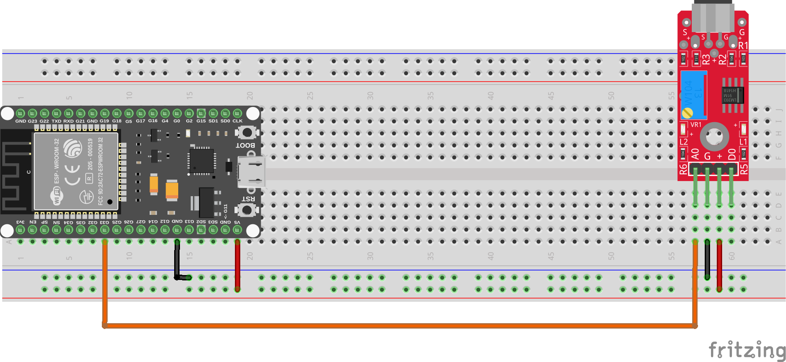

# Proyecto Final

Este documento describe el proyecto final que se llevará a cabo al concluir el curso. El objetivo del proyecto es aplicar los conocimientos adquiridos durante las lecciones para resolver un problema real o desarrollar una aplicación funcional.

Vamos a basarnos en la lectura del sensor de sonido KY-037 y publicar los datos obtenidos en un broker MQTT o utilizando una API REST Http utilizando MicroPython.

Además, también conectaremos la patilla para medir el umbral digital y que se envíe un evento cuando se supere dicho umbral.

Estos datos serán almacenados en una base de datos en la nube para su posterior análisis y visualización.

Recuerda que se van a realizar varios dispositivos que tendrán identificados el aula donde estarán instalados.

El proyecto incluirá las siguientes etapas:

1.- **Análisis de Requisitos**: Definir los objetivos del proyecto, las funcionalidades necesarias y los requisitos técnicos.

2.- **Diseño del Sistema**: Planificar la arquitectura del sistema, seleccionar los componentes de hardware y diseñar la estructura del software; e incluso simularlo usando el simulador Wokwi.

3.- **Implementación**: Desarrollar el código en MicroPython para la lectura del sensor KY-037, la conexión al broker MQTT o API REST, y el envío de datos.

4.- **Implementar Broker y almacenamiento en la nube**: Configurar un broker MQTT (como Mosquitto o HiveMQ) o una API REST para recibir los datos, y establecer una base de datos en la nube (como Firebase, AWS DynamoDB, etc.) para almacenar la 
información.

5.- **Pruebas y Validación**: Realizar pruebas exhaustivas para asegurar que el sistema funciona correctamente, incluyendo la lectura del sensor, la transmisión de datos y el almacenamiento en la nube.

6.- **Documentación**: Crear documentación detallada del proyecto, incluyendo el diseño del sistema, el código fuente, las instrucciones de configuración y uso, y cualquier otro aspecto relevante.

7.- **Creación de un Dashboard de Visualización**: Desarrollar un dashboard utilizando herramientas como Grafana, Power BI o una aplicación web personalizada para visualizar los datos almacenados en la base de datos en la nube.

8.- **Presentación del Proyecto**: Preparar una presentación para mostrar el proyecto, destacando los objetivos, el proceso de desarrollo, los desafíos enfrentados y los resultados obtenidos.