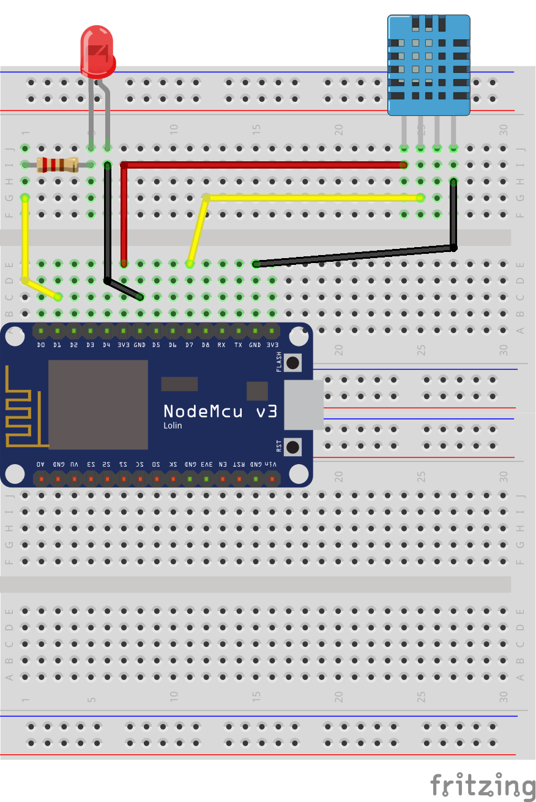

# Proyecto Final

Para afianzar conocimientos o poder llegar un poco más allá. Os dejamos dos ejercicios que podéis hacer.

** Sensor Temperatura**

Para este ejercicio, se necesitará los siguientes materiales:

* 1 Placa ESP32 o Raspberry Pi Pico
* 1 BreadBoard
* 1 Sensor Temperatura HC-11
* 1 led
* 1 resistencia 220Ohmios
* cables dupon

Seguidamente dejamos el montaje:



Por aquí el código del lector; en este caso, encederá el led si se llega a un umbral de temperatura y humedad:

```python
import dht
from machine import Pin

pindht = Pin(0)
ledpin = Pin(2, Pin.OUT)
dht11 = dht.DHT11(pindht)

while True:
  dht1.measure()
  temp = dht11.temperature()
  hum = dht11. humidity()
  if temp > 24 or hum > 55:
    ledpin.value(1)
  else:
    ledpin.value(0)
```

**Sensor Ultrasonidos**

Para este ejercicio, necesitaréis los siguientes materiales:

* 1 Placa ESP32 o Raspberry Pi Pico
* 1 breadBoard
* 1 Sensor Ultrasonidos HCSR-04
* 1 led
* 1 resistencia 220 Ohmios

Tras esto, realizamos el siguiente montaje.


Una vez conectado, necesitaremos una librería, para gestionar el sensor de ultrasonidos. Descargar el fichero python de la siguiente dirección:

[https://github.com/rsc1975/micropython-hcsr04](https://github.com/rsc1975/micropython-hcsr04)

Por último, crear el siguiente código fuente:

```python
from hcsr04 import HCSR04
from machine import Pin

sensor = HCSR04(trigger_pin=16, echo_pin=0)
led = Pin(2, Pin.OUT)

while(True):
    distance= sensor.distance_cm()
    if distance < 5:
        led.value(1)
    else:
        led.value(0)
```

Una vez escrito el código ya podemos probarlo; viendo si funciona correctamente al poner un obstaculo cerca del sensor.