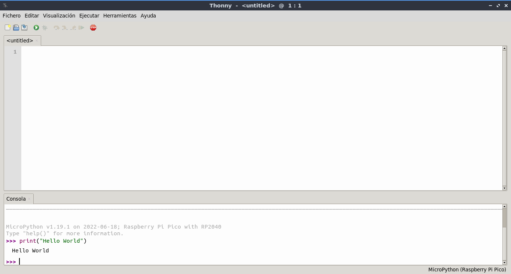
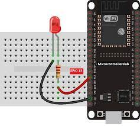
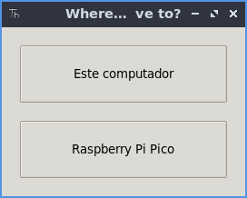
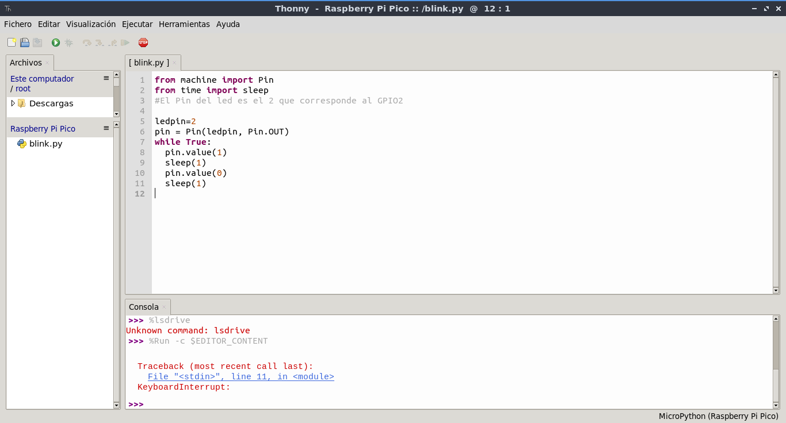

# Primeros Pasos

Una vez tenemos todo instalado, ya podemos empezar a utilizar nuestra placa. 

## Usar el Interprete

En nuestra placa esta instalado el interprete REPL como si de cualquier distribución python se tratara. Por lo que podemos trabajar con este interprete y dar algunas ordenes.

Si estamos utilizando Thonny, podemos verlo en la parte inferior de la pantalla.

**NOTA**: Recuerda configurar correctamente el puerto de la placa a utilizar.



Esto nos permitirá interactuar directamente con nuestra placa.

## Primer Programa con MicroPython

Vamos a ponernos ya manos a la obra; crearemos nuestro primer programa con MicroPython. Comenzando por lo más sencillo. Encender y apagar un Led.

Primero, vamos a realizar nuestro primer montaje; por lo que necesitaremos los siguientes materiales:

* 1 placa ESP32 o Raspberry Pi PICO
* 1 BreadBoard
* 1 Led
* 1 Resistencia 220Ohmios
* cables dupon

Realizaremos el siguiente Montaje



**NOTA**: En el caso de Raspberry Pi usar el mismo GPIO

Una vez hecho esto, crearemos en thonny el siguiente código Python.

```python
from machine import Pin
from time import sleep
#El Pin del led es el 2 que corresponde al GPIO2

ledpin=2
pin = Pin(ledpin, Pin.OUT)
while True:
  pin.value(1)
  sleep(1)
  pin.value(0)
  sleep(1)
```

Una vez escrito, lo guardaremos. Cuando le demos a guardar, nos preguntará donde lo queremos almacenar; si en nuestro equipo, o en nuestra placa.



Una vez almacenado, ya podemos verlo en nuestra placa. Podemos tener varios ficheros y verlos si pulsamos la opción _Visualización->archivos_. Podremos ver el listado de ficheros en nuestra placa y gestionarlos.



Una vez subido el fichero y ejecutado, ya deberíamos de poder ver parpadear nuestro led.

**NOTA**: En caso de no verlo, comprueba la polaridad del Led la patilla Larga es siempre la negativa.

## Ejercicio con 2 Leds

Os dejamos un Ejercicio con dos leds para que veáis como funcionaría:


Con el código correspondiente.

```python
from machine import Pin
from time import sleep

ledpin=2
ledpin2=4
pin = Pin(ledpin, Pin.OUT)
pin2 = Pin(ledpin2, Pin.OUT)
while True:
  pin.value(1)
  pin2.value(1)
  sleep(1)
  pin.value(0)
  pin2.value(0)
  sleep(1)
```

## Botones Con MicroPython

Tras ver como utilizar la salida a través de los leds; vamos a tratar de utilizar pulsadores para poder utilizar las entradas del microcontrolador. En este caso también utilizaremos la clase _Pin_ pero en este caso configuraremos cada puerto en modo IN.

Para este montaje, usaremos los siguientes materiales:

* 1 Placa ESP32 o Raspberry Pi PIco
* 1 BreadBoard
* 1 Led
* 1 resistencia 220Ohmios o similar.
* 1 resistenia 1KOhmios o similar.
* 1 Boton
* cables Dupon

Veamos el montaje:


Y seguidamente mostramos el código:

```python
from machine import Pin
import time

button=Pin(2,Pin.IN)
led=Pin(16,Pin.OUT)

while True:
    state=button.value()
    led.value(state)
    time.sleep(0.5)
```

**Ejercicio**: Realizar un montaje que sea necesario pulsar 2 Botones para que se encienda el led.

