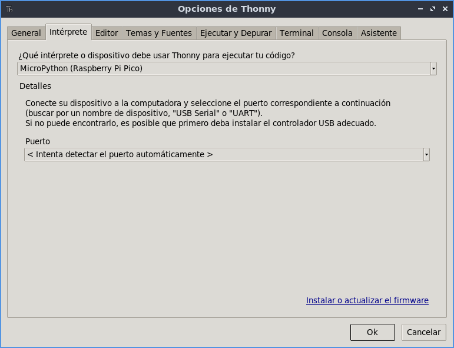
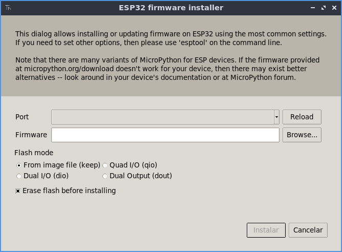
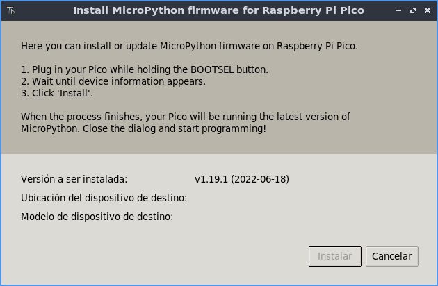

# Instalación MicroPython

Una vez tenemos nuestro entorno instalado y nuestras placas listas, vamos a proceder a instalar en ellas el interprete de MicroPython.

Dependiendo de la placa, las instrucciones son distintas pero vamos a ver varios métodos de instalación.

Para este paso, ya necesitaremos conectar nuestras placas a través de un cable USB (microUSB), para poder conectarlo a nuestro equipo.

### ESP32

Para quienes usen ESP32, necesitaran tener un par de cosas en cuenta. 

En primer lugar, si esta utilizando Windows, necesitará instalar los drivers para poder detectar la interfaz USB de nuestra placa. Para ello, necesitará instalar los drivers para el controlador CP210.

Puedes encontrarlos en el siguiente [enlace](https://www.silabs.com/developers/usb-to-uart-bridge-vcp-drivers?tab=downloads).

Una vez instalados, ya solo queda descargar la última versión del interprete de micropython para el ESP32.

Puedes encontrarla en el siguiente [enlace](https://micropython.org/download/esp32/).

Puedes encontrar más información sobre otras placas y versiones de MicroPython en la página oficial:

[https://micropython.org](https://micropython.org)

## Instalar usando Thonny

El primer metodo de instalación que veremos, es utilizando la utilidad que nos trae Thonny.

Para ello, abriremos thonny y seleccionaremos el menú _ejecutar->Elegir interprete..._ y en la pantalla seleccionaremos primero el tipo de interprete (MicroPython ESP32 o MicroPython Raspberry Pi Pico). Una vez hecho esto, pulsaremos en el enlace abajo derecha "instalar o actualizar software".



En este dialogo, podremos seleccionar en primer lugar, el dispositivo (puerto COM o fichero /dev) y donde se encuentra el interprete a instalar.

* Si esta instalando en un ESP32, seleccione el fichero .bin que descargó anteriormente.
* Si esta instalando en una Raspberry Pi Pico, espere unos segundos a que la placa sea detectada.

**NOTA**: Si no detecta la Raspberry pi Pico, pulse el botón _bootsel_ de la placa mientras inserta el USB.





## Instalación Manual

En caso de ser necesario, se puede instalar manualmente el interprete de MicroPython.

Para instalarlo, necesitaremos la herramienta _esptool_ (Solo para ESP32). Que podemos instalar con pip.

```bash
pip install esptool
```

Una vez instalada, podemos pasar a instalar el interprete.

### ESP32

Para la placa ESP32, usaremos la herramienta anteriormente mencionada.

Primero, borraremos la flash:

```bash
# Cambia /dev/ttyUSB0 por el nombre del puerto (COMX en windows)
esptool.py --chip esp32 --port /dev/ttyUSB0 erase_flash

```

Una vez borrada la flash, podremos instalar el interprete:

```bash
# No olvides cambiar tanto puerto como nombre del fichero
esptool.py --chip esp32 --port /dev/ttyUSB0 --baud 460800 write_flash -z 0x1000 esp32-20190125-v1.10.bin
```

Una vez hecho esto, ya puedes utilizar el interprete.

### Raspberry Pi Pico

Con Raspberry Pi Pico, la instalación es mucho más sencilla ya que no requiere de utilizar la herramienta _esptool_. Solo conecta la placa pulsando el botón _bootsel_ y se montará un volumen en tu equipo (como si de una unidad USB se tratara).

Después descarga el interprete microPython para Raspberry Pi Pico:

[Raspberry Pi Pico](https://micropython.org/download/rp2-pico/rp2-pico-latest.uf2)

[Raspberry Pi Pico W](https://micropython.org/download/rp2-pico-w/rp2-pico-w-latest.uf2)

Una vez decargado, pega el fichero en la unidad montada. Una vez terminado expulsa la unidad y ya estará instalado.