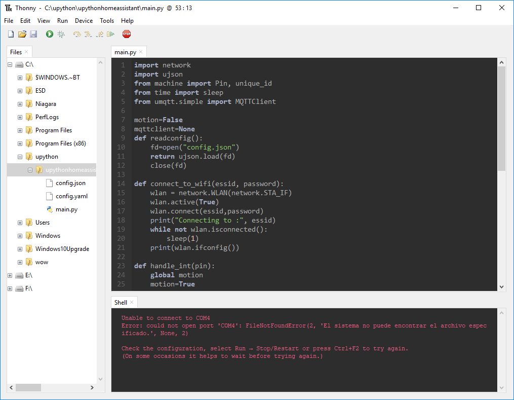

# Instalación del Entorno

En esta página encontras información sobre que necesitaremos para trabajar con MicroPython.

Los programas o utilidades que necesitaremos son:

* Python
* Thonny

Pasaremos a repasar cada elemento:

## Python

Para poder utilizar MicroPython y poder interactuar con las distintas placas, necesitaremos tener instalado Python 3.7 o superior.

Podemos descargar Python desde el siguiente [enlace](https://www.python.org/downloads/). Tambien podemos utilizar el gestor de paquetes de nuestra distribucion (Linux).

Para comprobar que version de python tenemos instalada, podemos usar el siguiente comando:

```bash
python --version
```

También es importante instalar el gestor de paquetes _pip_; para poder instalar las herramientas que necesitemos. Podemos comprobar que esta instalado con el siguiente comando:

```bash
pip --version
```

En caso de error, se puede usar el siguiente comando:

```bash
python -m pip --version
```

Para poder instalar pip usaremos el siguiente comando (En caso de no tenerlo instalado). 

```bash
python -m ensurepip --upgrade
```

## Thonny

Para este curso, usaremos el editor Thonny el cual nos va a permitir subir y ejecutar programas en nuestra placa programable.

Thonny es un editor muy ligero que esta construido en python y se puede utilizar de forma muy sencilla para crear nuestros programas tanto en local, como en MicroPython.



Para instalar thonny, podemos realizarlo de dos formas

### Instalación propia

Nos descargaremos e instalaremos el software del siguiente [enlace](https://thonny.org/).

### Instalación usando Pip

Para instalar usando Pip podemos usar los siguientes comandos:

```bash
pip install thonny
pip install thonny-esp # instala las extensiones para micropython
```

Despues simplemente escribiremos el siguiente comando:

```bash
thonny
```

En caso de error:

```bash
python -m thonny
```