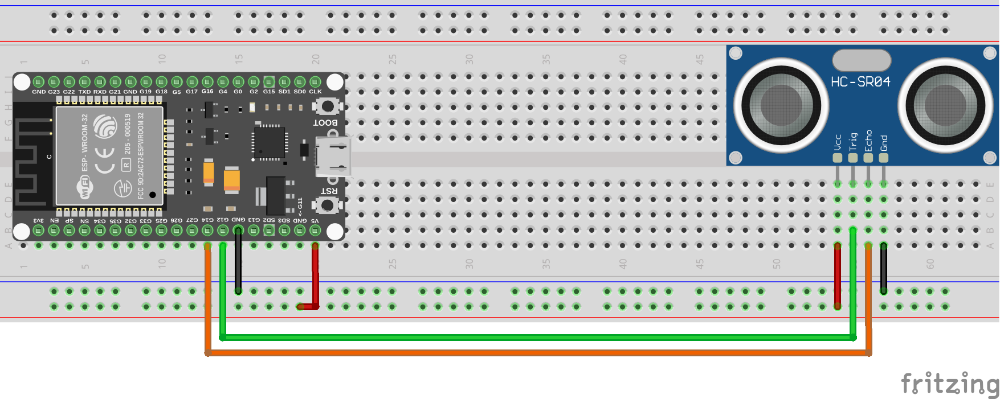
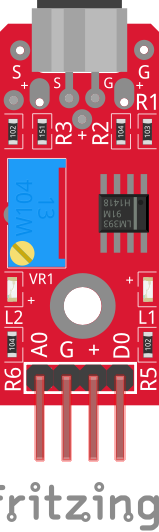

# Sensores Y Actuadores

En esta sección se describen los diferentes sensores y actuadores que pueden ser utilizados en el sistema. Cada uno de ellos tiene características específicas que permiten su integración y funcionamiento adecuado dentro del entorno.

## Sensores

Los sensores son dispositivos que detectan cambios en el entorno físico y convierten esa información en señales eléctricas que pueden ser interpretadas por el sistema. Algunos ejemplos comunes de sensores incluyen:

- Sensores de temperatura
- Sensores de humedad
- Sensores de luz
- Sensores de proximidad
- Sensores de presión

En este documento, vamos a ver algunos ejemplos de cómo utilizar estos sensores con entradas analógicas y digitales.

### Sensor de temperatura y Humedad DHT11

El DHT11 es un sensor digital que mide la temperatura y la humedad ambiental. Para utilizarlo, se necesita una librería específica que facilite la comunicación con el sensor.


**NOTA**: Puede encontrarse una versión con 3 pines. El funcionamiento es el mismo.  Solo cambia la forma de conectarlo.

Veamos como utilizar este sensor en nuestro dispositivo.

Para ello, utilizamos la clase `DHT11` de la librería `dht`. 

Veamos un ejemplo de conexión del sensor DHT11; para ello necesitamos:

- 1 Sensor DHT11
- Cables de conexión
- Protoboard

El montaje se realizará de la siguiente manera:


A continuación, se muestra un ejemplo de código para leer los valores de temperatura y humedad del sensor DHT11:

```python
import dht
from machine import Pin
import time

# Configurar el pin donde está conectado el DHT11
dht_pin = Pin(4)  # Cambia el número del pin según tu conexión
sensor = dht.DHT11(dht_pin)
while True:
    try:
        sensor.measure()  # Realizar la medición
        temperature = sensor.temperature()  # Obtener la temperatura
        humidity = sensor.humidity()  # Obtener la humedad
        print("Temperatura: {}°C  Humedad: {}%".format(temperature, humidity))
    except OSError as e:
        print("Error al leer el sensor:", e)
    time.sleep(2)  # Esperar 2 segundos antes de la siguiente lectura
```

Este código configura el pin donde está conectado el sensor DHT11, realiza mediciones periódicas y muestra los valores de temperatura y humedad en la consola. Asegúrate de conectar correctamente el sensor al pin especificado en el código.

### Sensor de ultrasonidos HC-SR04

El HC-SR04 es un sensor de ultrasonidos que se utiliza para medir distancias. Funciona enviando un pulso ultrasónico y midiendo el tiempo que tarda en regresar después de rebotar en un objeto.


Para utilizar el HC-SR04, necesitamos dos pines: uno para el disparo (trigger) y otro para la recepción (echo). Vamos a realizar un montaje simple para medir distancias utilizando este sensor.

Para este ejemplo, necesitaremos los siguientes componentes:

- 1 Sensor HC-SR04
- Cables de conexión
- Protoboard

El montaje se realizará de la siguiente manera:



A continuación, se muestra un ejemplo de código para medir la distancia utilizando el sensor HC-SR04:

```python
from machine import Pin, time_pulse_us
import time
trigger_pin = Pin(12, Pin.OUT)  # Pin de disparo
echo_pin = Pin(14, Pin.IN)     # Pin de recepción
def medir_distancia():
    # Enviar un pulso de 10 microsegundos al pin de disparo
    trigger_pin.value(0)
    time.sleep_us(2)
    trigger_pin.value(1)
    time.sleep_us(10)
    trigger_pin.value(0)

    # Medir el tiempo del pulso en el pin de recepción
    duracion = time_pulse_us(echo_pin, 1, 30000)  # Esperar hasta 30ms
    if duracion < 0:
        return -1  # Indica que no se recibió eco   
    # Calcular la distancia en centímetros
    distancia = (duracion / 2) / 29.1
    return distancia
while True:
    distancia = medir_distancia()
    if distancia != -1:
        print("Distancia: {:.2f} cm".format(distancia))
    else:
        print("No se detectó ningún objeto")
    time.sleep(1)
```

En este código, configuramos los pines de disparo y recepción, enviamos un pulso ultrasónico y medimos el tiempo que tarda en regresar. Luego, calculamos la distancia en centímetros y la mostramos en la consola.

### Sensor de sonido KY-037

El KY-037 es un sensor de sonido que puede detectar niveles de sonido en el entorno. Este sensor tiene una salida analógica que varía según la intensidad del sonido captado.



Para utilizar el KY-037, conectamos su salida analógica a un pin ADC del microcontrolador.

Vamos a realizar un ejemplo, para ello necesitaremos los siguientes componentes:

- 1 Sensor KY-037
- Cables de conexión
- Protoboard

El montaje se realizará de la siguiente manera:


A continuación, se muestra un ejemplo de código para leer los valores del sensor KY-037:

```python
from machine import ADC
import time

pin_number = 33  # Cambia esto al número de pin que estás utilizando
# Configurar el pin ADC
adc = ADC(pin_number)
while True:
    # Leer el valor analógico
    value = adc.read()
    print("Nivel de sonido:", value)
    time.sleep(1)
```

En este código, configuramos el pin ADC donde está conectado el sensor KY-037 y leemos periódicamente los valores analógicos que representan el nivel de sonido. Estos valores se imprimen en la consola cada segundo.

Como habrás podido observar, hay un pin extra que es digital. Este pin se usa como un umbral para activar una salida digital cuando el nivel de sonido supera cierto valor. Si deseas utilizar esta funcionalidad, puedes conectar este pin a un pin digital del microcontrolador y leer su estado de manera similar a como se hace con un botón en la sección de entradas digitales.

## Actuadores

Los actuadores son dispositivos que reciben señales eléctricas del sistema y realizan una acción física en el entorno. Algunos ejemplos comunes de actuadores incluyen:

- Motores
- Servomotores
- Relés
- Zumbadores

### Ejemplo: Control de un Zumbador

Para este ejemplo, necesitaremos los siguientes componentes:

- 1 Zumbador (buzzer)
- Cables de conexión
- Protoboard

El montaje se realizará de la siguiente manera:


A continuación, se muestra un ejemplo de código para hacer sonar el zumbador:

```python
from machine import Pin
import time
pin_number = 15  # Cambia esto al número de pin que estás utilizando
buzzer = Pin(pin_number, Pin.OUT)
while True:
    buzzer.value(1)  # Activar el zumbador
    time.sleep(0.5)  # Sonar durante 0.5 segundos
    buzzer.value(0)  # Desactivar el zumbador
    time.sleep(0.5)  # Esperar 0.5 segundos
```

En este código, configuramos el pin donde está conectado el zumbador y lo activamos y desactivamos periódicamente para crear un sonido intermitente.

Se puede usar una salida PWM para controlar el tono del zumbador.