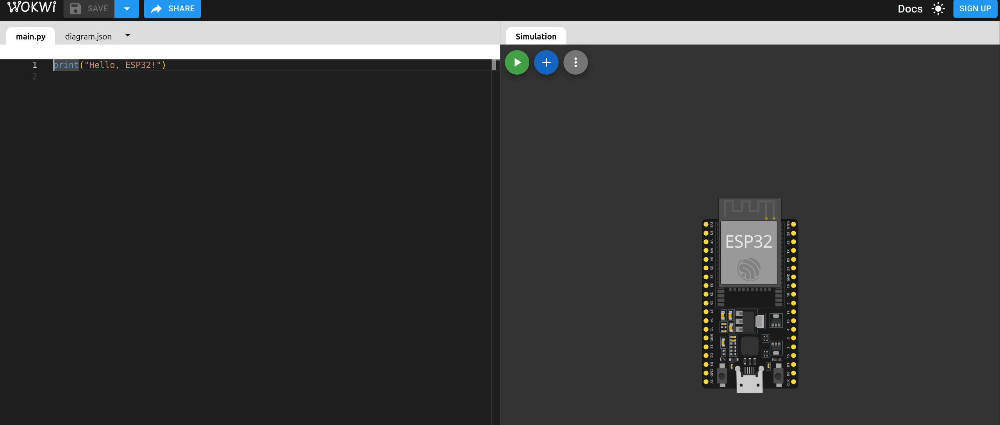
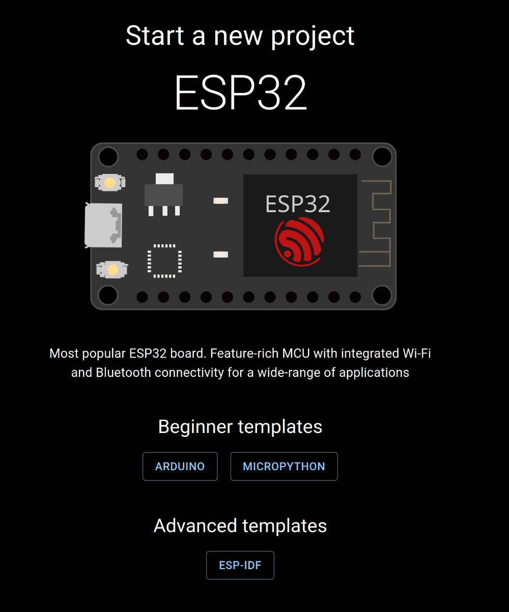

# Simulador MicroPython

Para poder practicar y aprender MicroPython sin necesidad de tener una placa física, podemos utilizar un simulador online llamado [Wokwi](https://wokwi.com/). Este simulador nos permite crear proyectos con placas como ESP32 y Raspberry Pi Pico, y programarlas utilizando MicroPython.



En la imagen superior podemos ver la interfaz del simulador Wokwi. A la derecha tenemos el área de diseño, donde podemos añadir componentes electrónicos como LEDs, resistencias, sensores, etc. En la izquierda tenemos el área de código, donde escribiremos nuestro programa en MicroPython. A la derecha tenemos la consola, donde podremos ver la salida de nuestro programa y cualquier mensaje de error.

## Crear un Proyecto en Wokwi

En primer lugar, entraremos en la siguiente dirección:

[https://wokwi.com/projects/new/](https://wokwi.com/projects/new/)

Seleccionaremos nuestra placa (ESP32 o Raspberry Pi Pico) y el tipo de proyecto (Arduino o MicroPython). En este caso, seleccionaremos MicroPython.



Una vez creado el proyecto, podremos empezar a añadir componentes electrónicos al área de diseño. Para ello, utilizaremos el menú de la izquierda, donde podremos buscar y seleccionar los componentes que necesitamos.

Vamos a realizar un montaje sencillo para encender y apagar un LED utilizando MicroPython. Añadiremos un LED y una resistencia al área de diseño, conectándolos a un pin GPIO de la placa. Mostramos en la siguiente imagen el montaje realizado:


**NOTA**: Para rotar un elemento pulsar R y para voltearlo P.

Es importante tener en cuenta que la resistencia debe estar en serie con el LED para limitar la corriente que pasa a través de él y evitar que se queme. En este caso, utilizaremos una resistencia de 220 ohmios.

Para cambiar el valor de la resistencia, haremos clic sobre ella y en el menú de propiedades a la derecha, cambiaremos el valor a 220.

Una vez hecho esto, escribiremos el siguiente código en el área de código:

```python
from machine import Pin
from time import sleep

ledpin=19
pin = Pin(ledpin, Pin.OUT)
while True:
  pin.value(1)
  sleep(1)
  pin.value(0)
  sleep(1)
```

Una vez escrito el código, podremos ejecutar el proyecto haciendo clic en el botón "Run" (Botón verde con flecha) en la parte superior de la pantalla. Veremos cómo el LED se enciende y apaga cada segundo, tal como hemos programado.

Este es un ejemplo sencillo de cómo utilizar el simulador Wokwi para aprender y practicar MicroPython sin necesidad de tener una placa física. Podemos experimentar con diferentes componentes y programas para ampliar nuestros conocimientos en MicroPython y electrónica.

En las siguientes páginas vamos a centrarnos en utilizar los diferentes dispositivos y elementos ya sea de forma física o utilizando este simulador online.